# Approach and Learning

> **IntentMiner: A Journey in Building an Intent Expansion Pipeline**

---

## Table of Contents

1. [Project Overview](#project-overview)
2. [Problem Understanding](#problem-understanding)
3. [Approach & Methodology](#approach--methodology)
4. [Technical Decisions](#technical-decisions)
5. [Implementation Journey](#implementation-journey)
6. [Challenges Faced](#challenges-faced)
7. [Key Learnings](#key-learnings)
8. [Best Practices Applied](#best-practices-applied)
9. [Future Improvements](#future-improvements)
10. [Conclusion](#conclusion)

---

## Project Overview

### What is IntentMiner?

IntentMiner is a **production-grade pipeline** designed to analyze customer messages and discover hidden patterns within existing intent categories. The goal is to propose new, more granular intents that improve conversational AI classification accuracy.

### Why This Project?

In conversational AI systems, intents are often **too broad**, leading to:
- Mixed customer needs under single labels
- Reduced personalization opportunities  
- Lower automation accuracy
- Missed analytics insights

This project addresses these challenges by automatically discovering sub-patterns and proposing intent refinements.

---

## Problem Understanding

### Initial Analysis

Before writing any code, I focused on understanding the core problem:

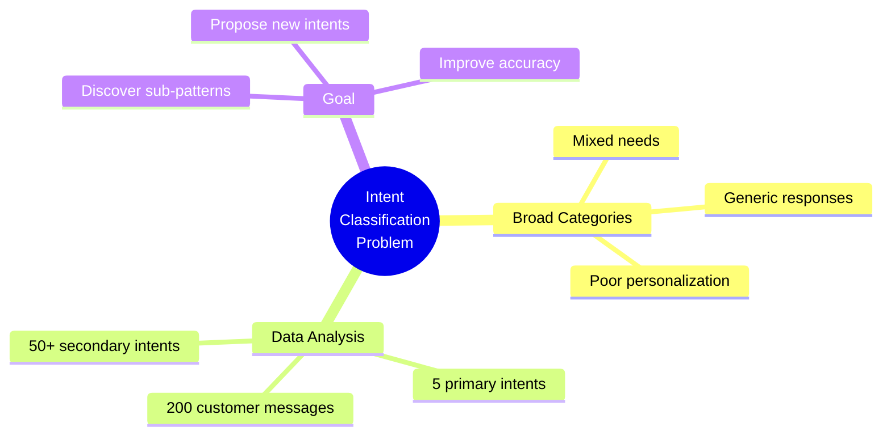

### Key Questions Asked

1. **What makes an intent "too broad"?**
   - Multiple distinct customer needs mapped to same category
   - High variance in message types within a single intent

2. **How do we identify sub-patterns?**
   - Keyword clustering
   - Semantic similarity
   - LLM-powered theme extraction

3. **What makes a good new intent proposal?**
   - Sufficient evidence (message count)
   - Distinct from parent intent
   - Actionable for the chatbot

---

## Approach & Methodology

### Design Philosophy

I adopted a **modular, stage-based architecture** with the following principles:

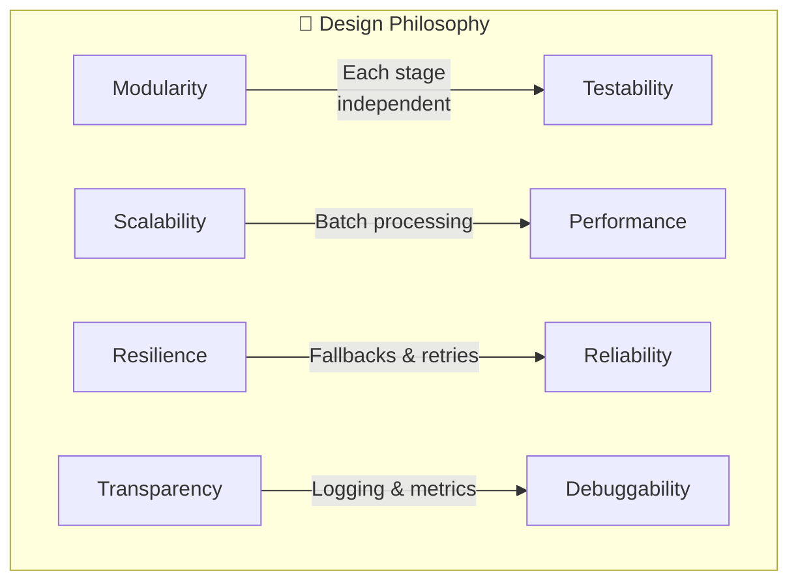

### The 7-Stage Pipeline Approach

Rather than building a monolithic system, I broke the problem into **7 distinct stages**:

| Stage | Purpose | Why This Approach |
|-------|---------|-------------------|
| **1. Data Ingestion** | Load & normalize | Clean data = better analysis |
| **2. Classification** | Baseline labeling | Understand current state first |
| **3. Grouping** | Organize by intent | Enable focused analysis |
| **4. Pattern Discovery** | Find sub-themes | Core intelligence layer |
| **5. Proposal Generation** | Create new intents | Transform patterns to proposals |
| **6. Guardrails** | Validate & filter | Prevent bad proposals |
| **7. Output Generation** | Reports & JSON | Actionable deliverables |

### Why This Staged Approach Works

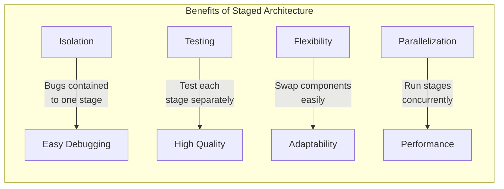

---

## Technical Decisions

### Decision 1: Multi-Provider LLM Support

**Problem:** Different users have access to different LLM providers.

**Solution:** Abstract LLM calls behind a unified `LLMClient` interface.

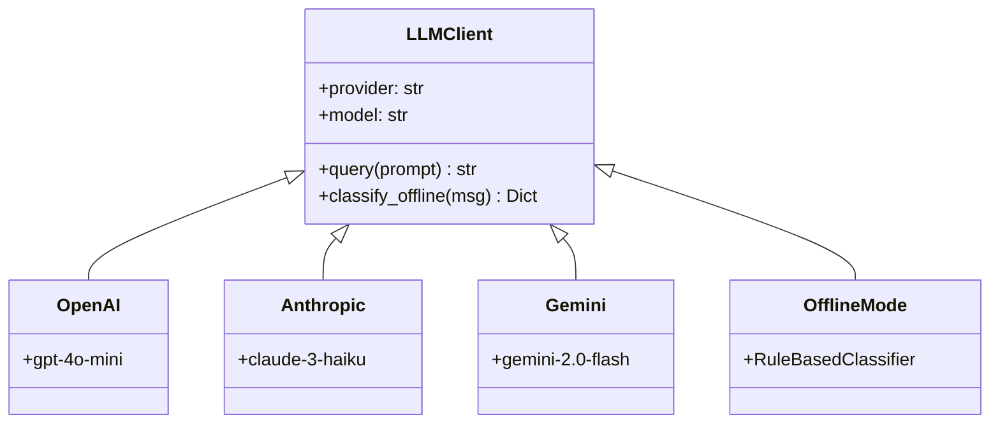

**Learning:** Abstraction layers add initial complexity but pay off in flexibility.

---

### Decision 2: Dual Pattern Discovery Methods

**Problem:** LLM-based analysis is powerful but requires API access and costs money.

**Solution:** Implement both keyword-based (free) and LLM-based (intelligent) methods.

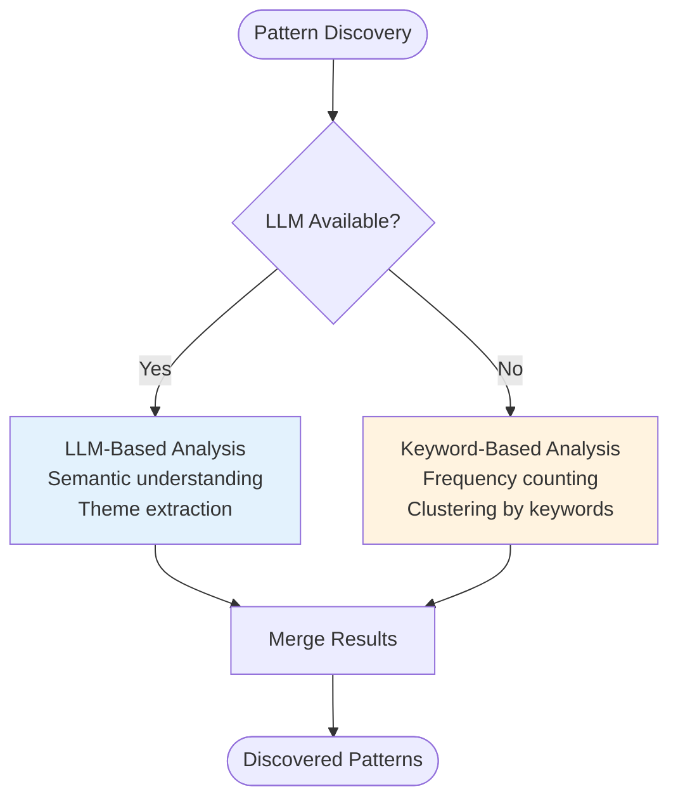

**Learning:** Always provide fallback mechanisms for critical functionality.

---

### Decision 3: Configurable Guardrails

**Problem:** How to prevent the system from proposing too many or low-quality intents?

**Solution:** Implement configurable guardrails with sensible defaults.

```yaml
# Guardrail Configuration
thresholds:
  min_support_absolute: 10    # At least 10 messages
  min_support_relative: 0.05  # At least 5% of parent
  max_patterns_per_category: 3
  max_total_proposals: 15
```

**Learning:** Hard-coded thresholds limit adaptability. Configuration-driven guardrails allow tuning for different datasets.

---

### Decision 4: Comprehensive Metrics

**Problem:** How do we know if the pipeline is working well?

**Solution:** Calculate and report multiple quality metrics.

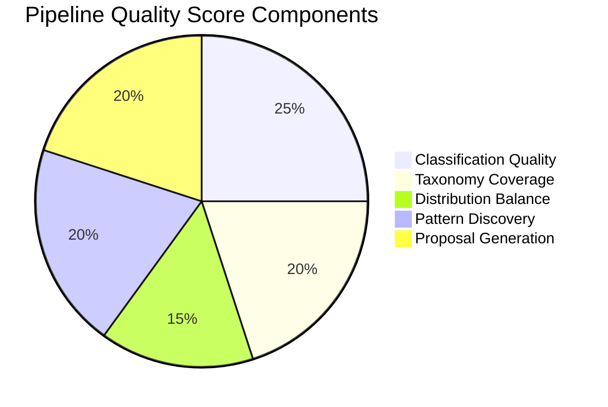

**Learning:** Metrics provide objective feedback and help identify areas for improvement.

---

## Implementation Journey

### Phase 1: Foundation (Data & Classification)

**Goal:** Get data flowing through the pipeline.

```mermaid
gantt
    title Implementation Timeline
    dateFormat  X
    axisFormat %s
    
    section Phase 1
    Data Ingestion     :done, p1a, 0, 1
    Text Normalization :done, p1b, 1, 2
    Classification     :done, p1c, 2, 4
    
    section Phase 2
    Grouping           :done, p2a, 4, 5
    Pattern Discovery  :done, p2b, 5, 8
    
    section Phase 3
    Proposals          :done, p3a, 8, 10
    Guardrails         :done, p3b, 10, 11
    Output Generation  :done, p3c, 11, 12
```

**Key Implementation Details:**

1. **JSON Loading with Validation**
   - Handle both list and dict formats for messages
   - Graceful error handling for malformed JSON

2. **Text Normalization**
   - Lowercase, strip whitespace
   - Remove extra spaces
   - Preserve meaning while standardizing

3. **Language Detection**
   - Simple heuristic for English vs Hindi
   - Useful for handling multilingual datasets

---

### Phase 2: Intelligence (Grouping & Pattern Discovery)

**Goal:** Extract meaningful patterns from classified messages.

**Key Insights:**

1. **Grouping Strategy**
   - Group by (primary, secondary) tuple
   - Calculate statistics per group
   - Identify under-represented groups

2. **Keyword Extraction**
   - Remove stopwords
   - Count term frequencies
   - Extract top-N keywords per group

3. **LLM Theme Discovery**
   - Craft prompts that ask for distinct themes
   - Parse structured JSON responses
   - Handle LLM response variability

---

### Phase 3: Output (Proposals & Reports)

**Goal:** Transform patterns into actionable proposals.

**Key Decisions:**

1. **Proposal Structure**
   - Include evidence (count, percentage, samples)
   - Add rationale for each proposal
   - Calculate quality scores

2. **Report Formats**
   - JSON for machine consumption
   - Markdown for human readability
   - Metrics dashboard for assessment

---

## Challenges Faced

### Challenge 1: LLM Response Parsing

**Problem:** LLMs don't always return valid JSON.

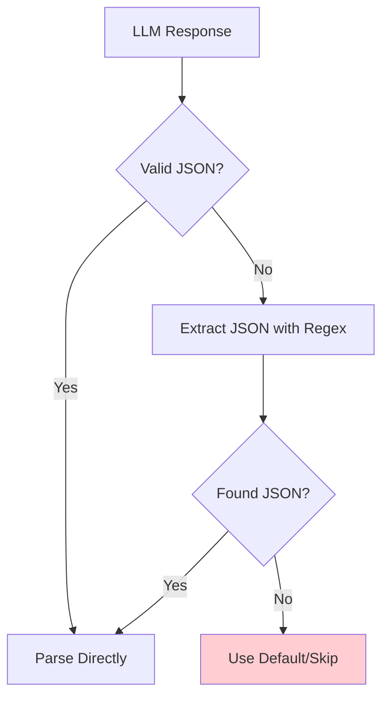

**Solution:** 
- Try direct JSON parsing first
- Fall back to regex extraction: `r'\{.*\}'`
- Ultimate fallback to default values

**Learning:** Never trust LLM output format. Always implement robust parsing.

---

### Challenge 2: Handling Small Groups

**Problem:** Groups with few messages don't have enough data for pattern discovery.

**Solution:**
- Skip groups with < 5 messages
- Use relaxed thresholds in offline mode
- Document this limitation in reports

**Learning:** Statistical significance matters. Don't force patterns from insufficient data.

---

### Challenge 3: Balancing Precision vs Recall

**Problem:** Too strict = miss valid patterns. Too loose = noisy proposals.

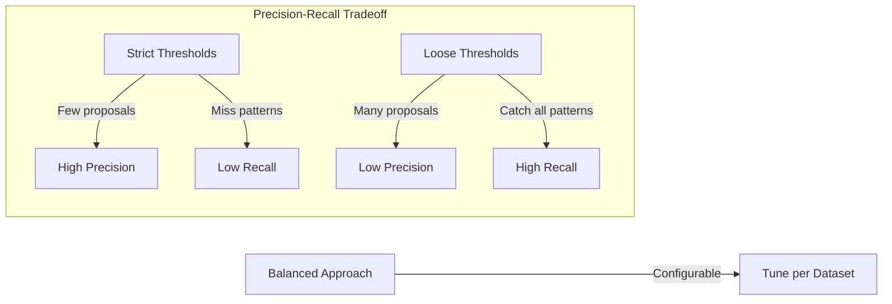

**Solution:** Make thresholds configurable. Start conservative, adjust based on results.

---

### Challenge 4: API Rate Limits & Costs

**Problem:** LLM APIs have rate limits and cost money.

**Solution:**
- Implement batch processing
- Add retry with exponential backoff
- Create offline mode for testing
- Cache results where possible

**Learning:** Design for API constraints from the start. Offline testing saves money and time.

---

## Key Learnings

### 1. Modular Design Pays Off

Breaking the pipeline into stages made:
- **Debugging easier** - isolate issues to specific stages
- **Testing simpler** - unit test each module
- **Maintenance manageable** - change one part without affecting others

### 2. Fallbacks Are Essential

Every external dependency should have a fallback:
- LLM unavailable → Rule-based classification
- JSON parsing fails → Regex extraction
- API times out → Exponential backoff retry

### 3. Configuration Over Hard-Coding

Making parameters configurable:
- Enables experimentation
- Supports different datasets
- Allows tuning without code changes

### 4. Metrics Drive Improvement

Without metrics, you can't know if changes help:
- Classification certainty rate
- Pattern discovery rate
- Proposal quality scores

### 5. Documentation Is Investment

Time spent on documentation:
- Reduces onboarding time for others
- Serves as reference during development
- Forces clearer thinking about design

---

## Best Practices Applied

### Code Organization

```
✅ Single Responsibility - Each class does one thing
✅ Dependency Injection - LLMClient passed to modules
✅ Configuration Objects - PipelineConfig dataclass
✅ Comprehensive Logging - Every stage logs progress
✅ Error Handling - Try/catch with meaningful messages
```

### Python Best Practices

```python
# Type hints for clarity
def classify_batch(self, messages: List[Dict]) -> List[Dict]:
    ...

# Dataclasses for configuration
@dataclass
class PipelineConfig:
    min_support_absolute: int = 10
    ...

# Context managers for file handling
with open(filepath, 'r', encoding='utf-8') as f:
    data = json.load(f)
```

### Documentation Best Practices

```
✅ README with quick start
✅ Architecture document with diagrams
✅ Inline code comments
✅ Docstrings for all classes/methods
✅ Configuration file comments
```

---

## Future Improvements

### Short-Term Enhancements

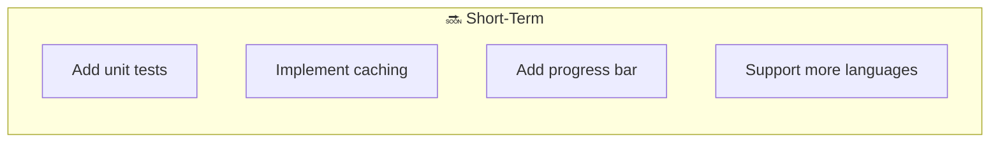

### Long-Term Vision

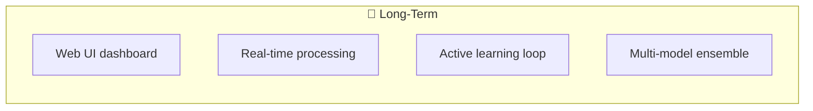

### Potential Features

| Feature | Benefit | Complexity |
|---------|---------|------------|
| **Web Dashboard** | Visual exploration of results | High |
| **Streaming Processing** | Handle continuous message flow | High |
| **A/B Testing Integration** | Validate proposals in production | Medium |
| **Custom Model Fine-tuning** | Domain-specific classification | High |
| **Export to Chatbot Platforms** | Direct integration | Medium |

---

## Conclusion

### What I Built

A **complete, production-ready pipeline** that:
- Analyzes customer messages at scale
- Discovers hidden intent patterns
- Proposes actionable new intents
- Provides quality metrics and reports

### What I Learned

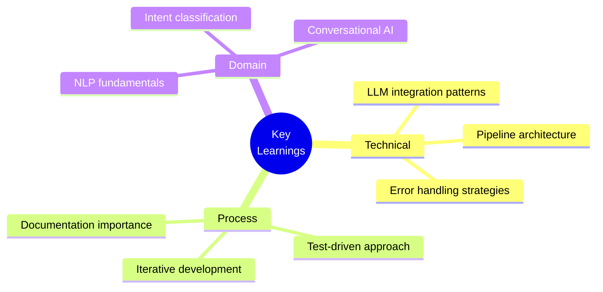

### Final Thoughts

Building IntentMiner reinforced that **good software engineering** matters as much as **clever algorithms**. The modular design, comprehensive error handling, and extensive documentation make this not just a working solution, but a **maintainable and extensible** one.

The project demonstrates that even complex AI/ML pipelines benefit from traditional software engineering principles:
- **Separation of concerns**
- **Configuration over hard-coding**
- **Graceful degradation**
- **Comprehensive testing and metrics**

---

## References & Resources

### Technologies Used
- Python 3.9+
- OpenAI API / Anthropic API / Google Gemini
- NumPy for numerical operations
- YAML for configuration

### Concepts Applied
- Intent Classification in NLP
- Keyword Extraction & TF-IDF
- Semantic Clustering
- Pipeline Architecture Patterns

### Tools & Platforms
- VS Code for development
- Git/GitHub for version control
- Mermaid for diagrams

---

