# IntentMiner - Architecture & Design Document

> **A production-grade pipeline to discover and propose missing intents in conversational AI systems**

---

## Table of Contents

1. [Overview](#overview)
2. [Problem Statement](#problem-statement)
3. [Solution Architecture](#solution-architecture)
4. [Pipeline Stages](#pipeline-stages)
5. [Core Components](#core-components)
6. [Data Flow](#data-flow)
7. [Configuration](#configuration)
8. [Input/Output Specifications](#inputoutput-specifications)
9. [Guardrails & Quality Control](#guardrails--quality-control)
10. [Deployment Guide](#deployment-guide)
11. [API Reference](#api-reference)

---

## Overview

**IntentMiner** is an intelligent pipeline that analyzes customer messages to discover hidden patterns within existing intent categories and proposes new, more granular intents to improve conversational AI classification accuracy.

### Key Capabilities

| Feature | Description |
|---------|-------------|
| **Pattern Discovery** | LLM-powered semantic analysis combined with keyword clustering |
| **Scalable Processing** | Batch processing architecture supporting 200+ messages |
| **Multi-Provider LLM Support** | OpenAI, Anthropic, and Google Gemini integration |
| **Offline Mode** | Rule-based classification when API is unavailable |
| **Robust Guardrails** | Minimum support thresholds, distinctiveness checks, fragmentation prevention |
| **Comprehensive Reporting** | JSON proposals + Markdown analysis reports + Metrics dashboard |

---

## Problem Statement

### The Challenge

Conversational AI platforms classify customer intents to automate responses. However, current intent hierarchies are often **too broad**, leading to:

```
┌─────────────────────────────────────────────────────────────────┐
│                    CURRENT STATE (PROBLEM)                       │
├─────────────────────────────────────────────────────────────────┤
│                                                                  │
│   Customer Message: "How to use this product?"                   │
│   Customer Message: "What's special about it?"                   │
│   Customer Message: "What are the ingredients?"                  │
│                                                                  │
│                           ↓                                      │
│                                                                  │
│   ALL classified as → "product_info" (too broad!)                │
│                                                                  │
│   Problems:                                                      │
│   ✗ Mixed customer needs under single intent                    │
│   ✗ Reduced personalization opportunities                       │
│   ✗ Lower automation accuracy                                   │
│   ✗ Missed analytics insights                                   │
│                                                                  │
└─────────────────────────────────────────────────────────────────┘
```

### The Solution

```
┌─────────────────────────────────────────────────────────────────┐
│                    DESIRED STATE (SOLUTION)                      │
├─────────────────────────────────────────────────────────────────┤
│                                                                  │
│   Customer Message: "How to use this product?"                   │
│                    → "product_usage_instructions" ✓              │
│                                                                  │
│   Customer Message: "What's special about it?"                   │
│                    → "product_benefits_inquiry" ✓                │
│                                                                  │
│   Customer Message: "What are the ingredients?"                  │
│                    → "product_composition" ✓                     │
│                                                                  │
│   Benefits:                                                      │
│   ✓ Tailored responses for each specific need                   │
│   ✓ Better personalization and automation                       │
│   ✓ Improved classification accuracy                            │
│   ✓ Richer analytics and insights                               │
│                                                                  │
└─────────────────────────────────────────────────────────────────┘
```

---

## Solution Architecture

### High-Level Architecture Diagram

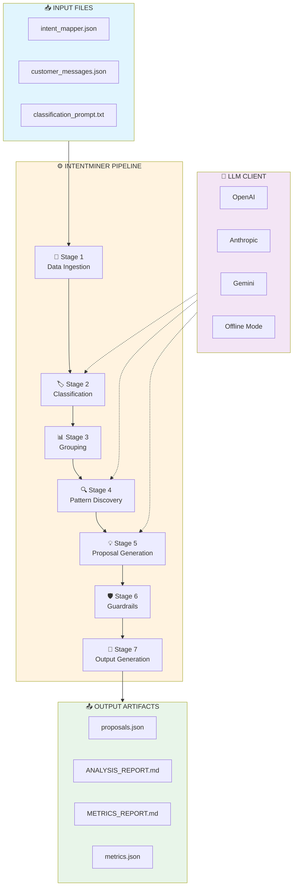

### Pipeline Flow Detail

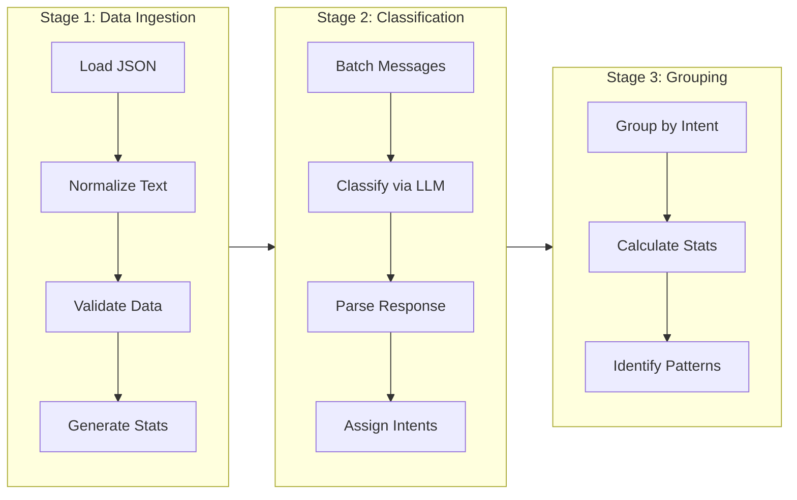

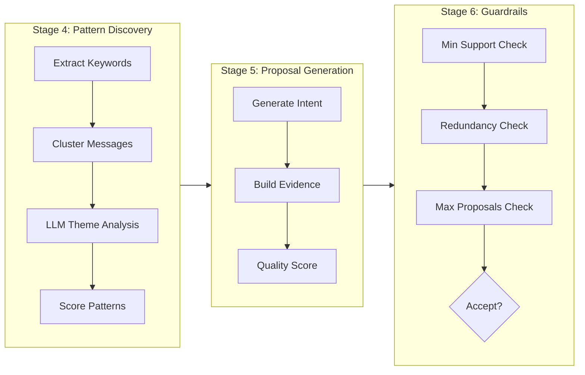

### Component Architecture

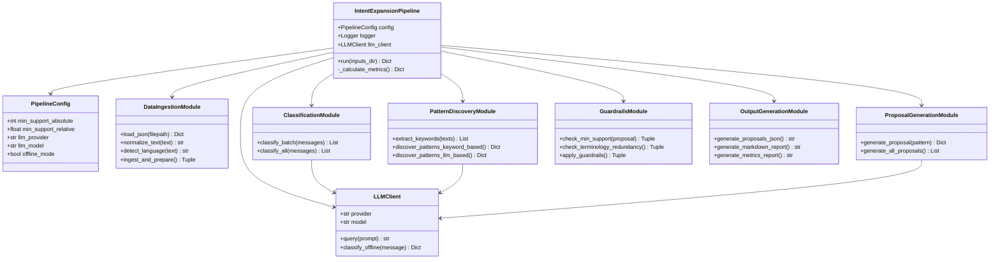

### Data Transformation Flow

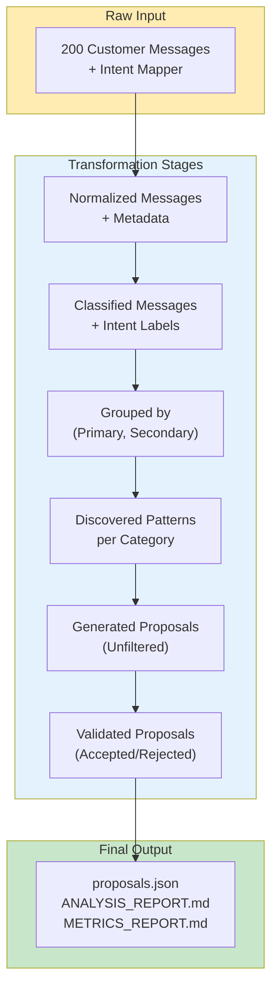

### Guardrails Decision Flow

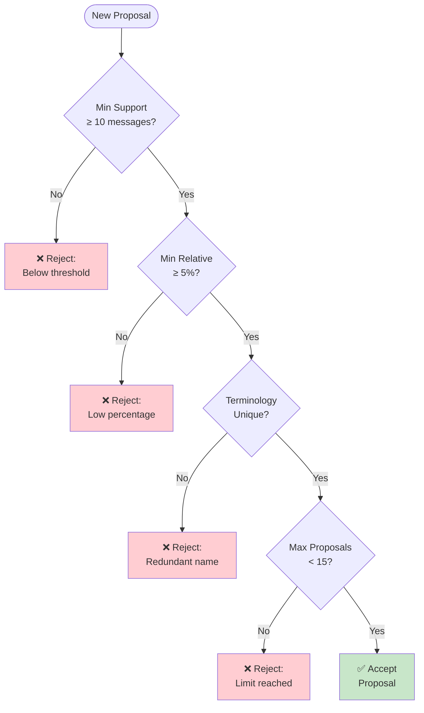

### LLM Provider Strategy

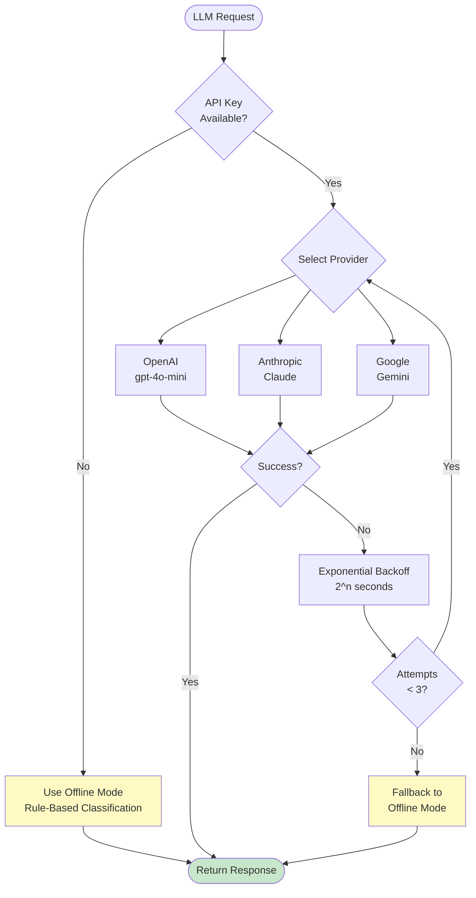

### Technology Stack

| Layer | Technology |
|-------|------------|
| **Language** | Python 3.9+ |
| **LLM Providers** | OpenAI (gpt-4o-mini), Anthropic (Claude), Google Gemini |
| **Data Processing** | NumPy, Collections, Dataclasses |
| **Configuration** | YAML, Environment Variables |
| **Logging** | Python logging module |

---

## Pipeline Stages

### Stage 1: Data Ingestion & Preparation

**Purpose:** Load, validate, and normalize input data

```python
class DataIngestionModule:
    """
    Responsibilities:
    - Load JSON files (intent_mapper, customer_messages)
    - Normalize text (lowercase, strip whitespace)
    - Detect language (English, Hindi, etc.)
    - Generate dataset statistics
    """
```

**Process Flow:**

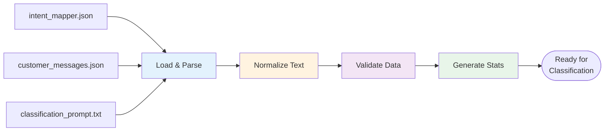

**Key Operations:**
- Text normalization: lowercase, strip, remove extra whitespace
- Language detection: English, Hindi (Devanagari), Chinese, Unknown
- Metadata enrichment: message ID, length, language

---

### Stage 2: Message Classification (Baseline)

**Purpose:** Classify all messages using the current intent taxonomy

```python
class ClassificationModule:
    """
    Responsibilities:
    - Use existing classification prompt + LLM
    - Assign (primary_intent, secondary_intent) to each message
    - Support batch processing for efficiency
    - Handle errors and uncertain classifications
    """
```

**Classification Modes:**

| Mode | Description | Use Case |
|------|-------------|----------|
| **LLM-based** | Uses configured LLM provider | Production with API access |
| **Offline** | Rule-based keyword matching | Testing, no API available |

**Output per Message:**
```json
{
    "message_id": "msg_42",
    "primary": "specific_product",
    "secondary": "product_info",
    "confidence": 0.85
}
```

---

### Stage 3: Grouping & Organization

**Purpose:** Organize classified messages by intent pairs

```python
class GroupingModule:
    """
    Responsibilities:
    - Group messages by (primary, secondary) intent
    - Calculate group statistics
    - Identify under-represented groups
    """
```

**Group Statistics:**
- Message count per group
- Percentage distribution
- Average confidence scores
- Sample messages

---

### Stage 4: Pattern Discovery (Core Intelligence)

**Purpose:** Find hidden themes/patterns within each intent group

```python
class PatternDiscoveryModule:
    """
    Responsibilities:
    - Extract keyword frequencies & n-grams
    - Identify semantic clusters
    - Use LLM to discover sub-topics
    - Score pattern distinctiveness
    """
```

**Discovery Methods:**

#### Method 1: Keyword-Based (Lightweight, Deterministic)

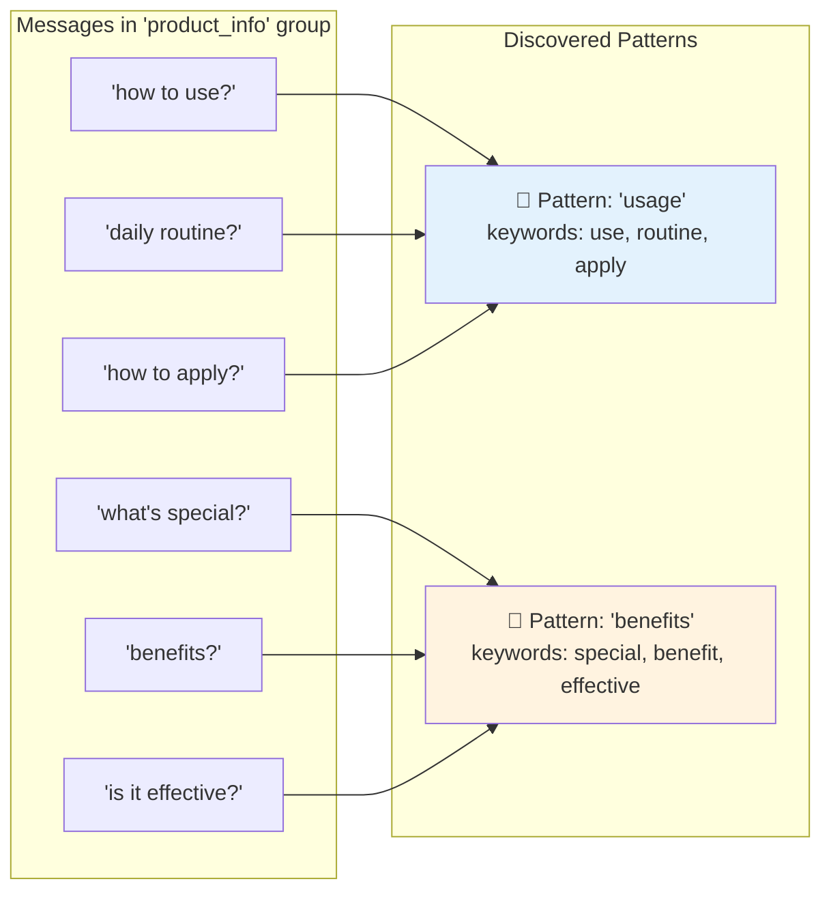

#### Method 2: LLM-Based (Intelligent, Semantic)

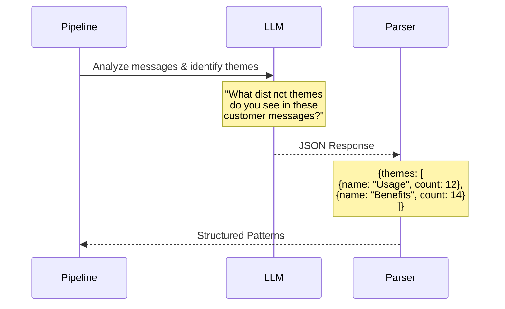

---

### Stage 5: Proposal Generation

**Purpose:** Create new intent proposals from discovered patterns

```python
class ProposalGenerationModule:
    """
    Responsibilities:
    - Generate intent name, ID, description
    - Align with existing taxonomy style
    - Calculate evidence metrics
    - Score proposal quality
    """
```

**Proposal Structure:**
```json
{
    "type": "new_secondary",
    "parent_primary_id": "specific_product",
    "parent_secondary_id": "product_info",
    "name": "Product Usage Instructions",
    "id": "product_usage",
    "description": "When customer asks how to use/apply a product",
    "evidence": {
        "message_count": 12,
        "percentage": "37.5%",
        "key_phrases": ["how", "use", "apply"],
        "sample_messages": ["How to use?", "Daily routine?"],
        "rationale": "Distinct from general info - requires instructions"
    },
    "quality_score": 0.89
}
```

---

### Stage 6: Guardrails & Validation

**Purpose:** Filter proposals to ensure quality and prevent issues

```python
class GuardrailsModule:
    """
    Responsibilities:
    - Minimum support threshold checks
    - Terminology redundancy detection
    - Over-fragmentation prevention
    - Semantic distinctiveness validation
    """
```

**Guardrail Checks:**

| Check | Threshold | Purpose |
|-------|-----------|---------|
| **Min Support (Absolute)** | ≥10 messages | Ensure statistical significance |
| **Min Support (Relative)** | ≥5% of parent | Ensure meaningful proportion |
| **Terminology Redundancy** | <50% token overlap | Prevent duplicate intents |
| **Max Total Proposals** | ≤15 | Prevent taxonomy explosion |
| **Max Per Category** | ≤3 | Prevent over-fragmentation |

---

### Stage 7: Output Generation

**Purpose:** Generate final deliverables

```python
class OutputGenerationModule:
    """
    Outputs:
    - proposals.json: Machine-readable proposals
    - ANALYSIS_REPORT.md: Human-readable findings
    - METRICS_REPORT.md: Pipeline assessment metrics
    - metrics.json: Raw metrics data
    - pipeline.log: Execution logs
    """
```

---

## Core Components

### LLMClient

**Multi-provider abstraction layer with built-in resilience:**

```python
class LLMClient:
    """
    Features:
    - Provider abstraction (OpenAI, Anthropic, Gemini)
    - Automatic retry with exponential backoff
    - Graceful fallback to offline mode
    - Configurable timeout and retries
    """
    
    # Supported Providers
    providers = ["openai", "anthropic", "gemini"]
    
    # Fallback Chain
    # 1. Try configured provider
    # 2. Retry with exponential backoff (2^n seconds)
    # 3. Fall back to offline mode (rule-based)
```

### RuleBasedClassifier

**Offline classification using keyword matching:**

```python
class RuleBasedClassifier:
    """
    Intent categories and keywords:
    
    basic_interactions:
      - greet: ["hi", "hello", "namaste"]
      - confirm: ["yes", "haan", "ji"]
      
    specific_product:
      - product_info: ["product", "what is", "details"]
      - how_to_use: ["how to use", "kaise use", "apply"]
      
    logistics:
      - order_status: ["track", "where is", "delivery"]
    """
```

### PipelineConfig

**Centralized configuration management:**

```python
@dataclass
class PipelineConfig:
    # Thresholds
    min_support_absolute: int = 10
    min_support_relative: float = 0.05
    max_patterns_per_category: int = 3
    max_total_proposals: int = 15
    
    # LLM Settings
    llm_provider: str = "openai"
    llm_model: str = "gpt-4o-mini"
    llm_temperature: float = 0.3
    llm_batch_size: int = 50
    
    # Processing
    normalize_text: bool = True
    offline_mode: bool = False
```

---

## Data Flow

### Complete Data Transformation Pipeline

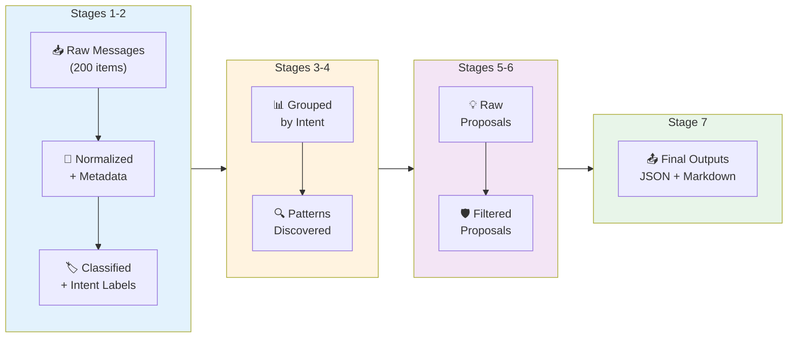

### Message Transformation Example

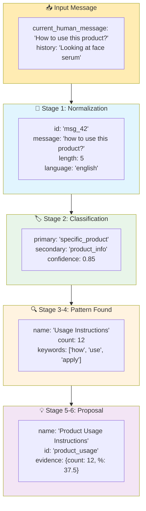

---

## Configuration

### config.yaml Structure

```yaml
# Thresholds & Constraints
thresholds:
  min_support_absolute: 10      # Minimum messages for proposal
  min_support_relative: 0.05    # 5% of parent category
  semantic_distinctiveness_threshold: 0.6
  max_patterns_per_category: 3
  max_total_proposals: 15

# LLM Configuration
llm:
  provider: "openai"            # openai | anthropic | gemini
  model: "gpt-4o-mini"
  temperature: 0.3
  batch_size: 50
  timeout: 30
  max_retries: 3

# Text Processing
processing:
  normalize_text: true
  remove_duplicates: true
  detect_language: true
  handle_non_english: "skip"    # skip | translate | include
  min_message_length: 3

# Output Settings
output:
  directory: "./output/"
  log_level: "INFO"
```

### Environment Variables

```bash
# .env file
OPENAI_API_KEY=sk-...
ANTHROPIC_API_KEY=sk-ant-...
GEMINI_API_KEY=...
```

---

## Input/Output Specifications

### Input Files

#### 1. intent_mapper.json
```json
{
    "intent_mapper": [
        {
            "primary_intent_name": "Specific Product",
            "primary_intent_id": "specific_product",
            "secondary_intents": [
                {
                    "name": "Product Info",
                    "id": "product_info",
                    "description": "When customer wants to know about a product"
                }
            ]
        }
    ]
}
```

#### 2. customer_messages.json
```json
{
    "customer_messages": [
        {
            "current_human_message": "How to use this product?",
            "history": "Looking at face serum"
        }
    ]
}
```

#### 3. classification_prompt.txt
```text
You are a customer service intent classifier.

History: {history}
Message: {message}

Available Intents:
{use_cases}

Classify the message and respond with JSON:
{"primary": "...", "secondary": "..."}
```

### Output Files

#### 1. proposals.json
```json
{
    "metadata": {
        "timestamp": "2025-12-06T10:00:00",
        "total_messages_analyzed": 200,
        "new_intents_proposed": 4
    },
    "proposed_intents": [
        {
            "name": "Product Usage Instructions",
            "id": "product_usage",
            "parent_primary_id": "specific_product",
            "parent_secondary_id": "product_info",
            "description": "...",
            "evidence": {...}
        }
    ]
}
```

#### 2. ANALYSIS_REPORT.md
Human-readable markdown report with findings, methodology, and recommendations.

#### 3. METRICS_REPORT.md
Pipeline assessment metrics including classification quality, coverage, and proposal scores.

---

## Guardrails & Quality Control

### Quality Scoring System

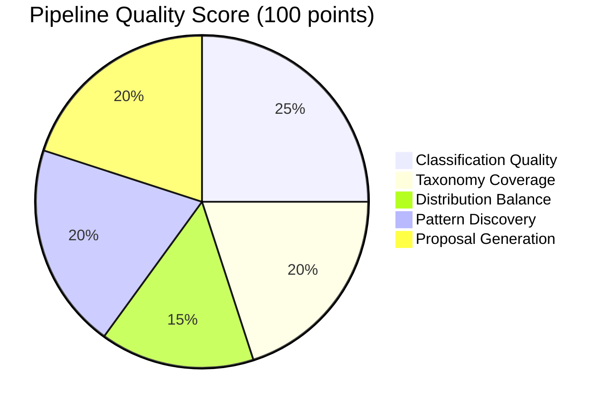

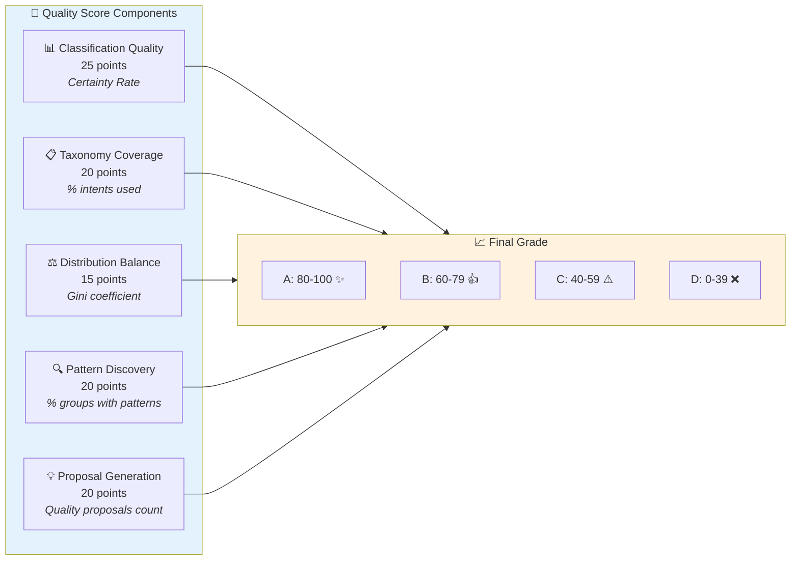

### Validation Rules

| Rule | Implementation | Failure Action |
|------|----------------|----------------|
| Min Message Count | `count >= 10` | Reject proposal |
| Min Percentage | `percentage >= 5%` | Reject proposal |
| Unique Name | `<50% overlap` | Reject proposal |
| Max Proposals | `total <= 15` | Stop accepting |
| Valid JSON | Schema validation | Log error, skip |

---

## Deployment Guide

### Quick Start

```bash
# 1. Setup environment
python -m venv venv
source venv/bin/activate  # Windows: venv\Scripts\activate
pip install -r requirements.txt

# 2. Configure API key
echo "OPENAI_API_KEY=sk-..." > .env

# 3. Prepare input files in inputs/ directory

# 4. Run pipeline
python intent_expansion_pipeline.py --input inputs/ --output output/

# 5. Review results
cat output/ANALYSIS_REPORT.md
```

### Command Line Options

```bash
python intent_expansion_pipeline.py [OPTIONS]

Options:
  --config FILE    Config file path (default: config.yaml)
  --input DIR      Input directory (default: inputs/)
  --output DIR     Output directory (default: output/)
  --offline        Run in offline mode (no API required)
```

### Running in Offline Mode

```bash
# No API key required - uses rule-based classification
python intent_expansion_pipeline.py --offline
```

---

## API Reference

### Main Classes

| Class | Purpose |
|-------|---------|
| `IntentExpansionPipeline` | Main orchestrator |
| `PipelineConfig` | Configuration dataclass |
| `LLMClient` | LLM provider abstraction |
| `DataIngestionModule` | Stage 1: Data loading |
| `ClassificationModule` | Stage 2: Classification |
| `GroupingModule` | Stage 3: Grouping |
| `PatternDiscoveryModule` | Stage 4: Pattern detection |
| `ProposalGenerationModule` | Stage 5: Proposal creation |
| `GuardrailsModule` | Stage 6: Validation |
| `OutputGenerationModule` | Stage 7: Report generation |

### Usage Example

```python
from intent_expansion_pipeline import IntentExpansionPipeline, PipelineConfig

# Create configuration
config = PipelineConfig(
    llm_provider="openai",
    llm_model="gpt-4o-mini",
    min_support_absolute=10,
    output_dir="./output/"
)

# Run pipeline
pipeline = IntentExpansionPipeline(config)
result = pipeline.run("./inputs/")

print(f"Status: {result['status']}")
print(f"Proposals: {result['proposals']}")
```

---

## Project Structure

```
exported-assets/
├── intent_expansion_pipeline.py    # Main pipeline implementation (1600+ lines)
├── config.yaml                     # Configuration file
├── requirements.txt                # Python dependencies
├── ARCHITECTURE.md                 # This document
│
├── inputs/                         # Input data directory
│   ├── intent_mapper.json          # Current intent hierarchy
│   ├── customer_messages.json      # Customer messages to analyze
│   └── classification_prompt.txt   # Classification prompt template
│
└── output/                         # Generated outputs
    ├── proposals.json              # Machine-readable proposals
    ├── ANALYSIS_REPORT.md          # Human-readable analysis
    ├── METRICS_REPORT.md           # Pipeline metrics
    ├── metrics.json                # Raw metrics data
    └── pipeline.log                # Execution logs
```

---


